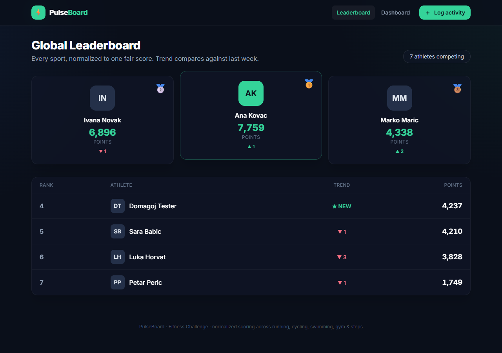
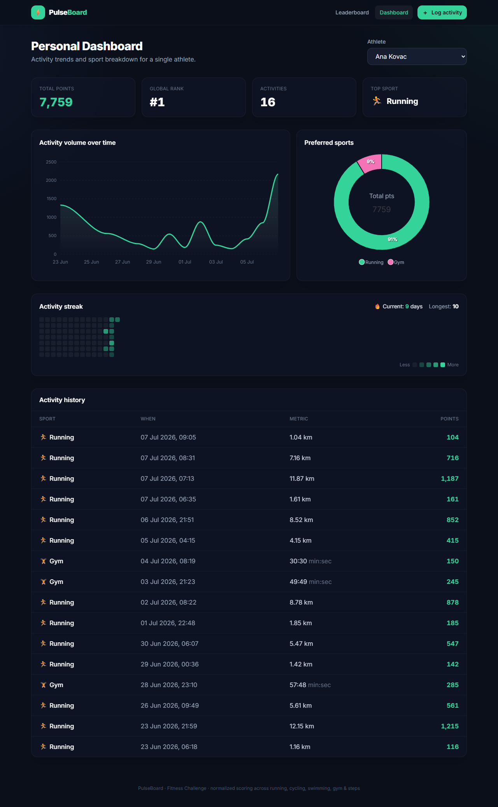
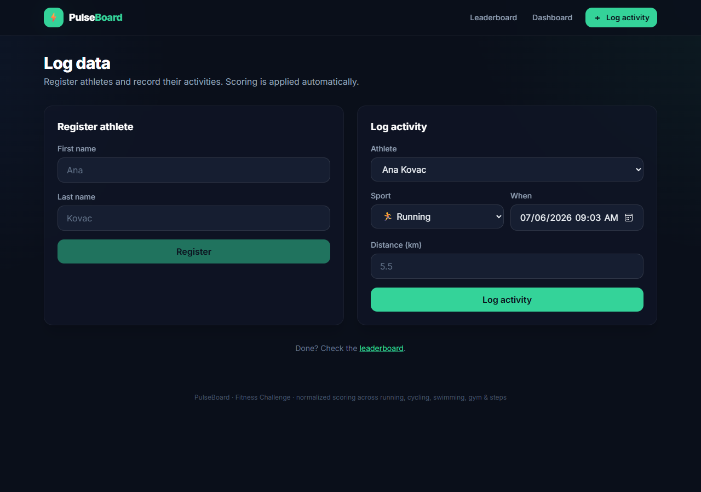

# PulseBoard — Fitness Challenge

A full-stack fitness challenge application that gamifies physical activity. It ingests a diverse
set of sports, **normalizes each into a unified "Points" score**, ranks everyone on a global
leaderboard (with weekly rank trends), and gives every athlete a personal dashboard to visualize
their habits over time — including an activity-over-time chart, a sport breakdown, a GitHub-style
**activity heatmap**, and **streak** tracking.

| Leaderboard | Dashboard | Log data |
|---|---|---|
|  |  |  |

---

## Tech stack

| Layer | Technology |
|---|---|
| Backend | C# / ASP.NET Core 9 Web API |
| Persistence | EF Core 9 + SQLite (code-first migrations) |
| Validation | FluentValidation |
| Frontend | Angular 20 (standalone components, signals) |
| Styling | Tailwind CSS |
| Charts | ApexCharts (`ng-apexcharts`) |
| API docs | OpenAPI + Scalar |
| Tests | xUnit (40 unit + 8 integration) |

---

## Prerequisites

- [.NET SDK 9](https://dotnet.microsoft.com/download)
- [Node.js 20+](https://nodejs.org) and npm
- (optional) `dotnet tool install --global dotnet-ef` — only needed if you want to add migrations

---

## Running locally

The app is two processes: the API (`:5207`) and the Angular dev server (`:4200`). The frontend
proxies `/api` to the backend, so start the API first.

### 1. Backend

```bash
cd backend/FitnessChallenge.Api
dotnet run
```

On first start it applies migrations and **seeds demo data** (6 athletes with ~3 weeks of
activities) so the leaderboard and charts are populated immediately.

- API base: `http://localhost:5207/api`
- Interactive API docs (Scalar): `http://localhost:5207/scalar/v1`

### 2. Frontend

```bash
cd frontend
npm install
npm start
```

Open **http://localhost:4200**.

### 3. Tests

```bash
cd backend
dotnet test
```

---

## Scoring rules

All activities normalize to integer **Points**. The subtlety is *where* the flooring happens —
each metric type floors at a different stage:

| Sport | Rate | Flooring |
|---|---|---|
| Running | 100 pts / km | floor **after** multiplying (`1.55 km × 50 = 77.5 → 77`) |
| Walking | 50 pts / km | ↑ |
| Cycling | 25 pts / km | ↑ |
| Swimming | 15 pts / min | floor to whole minutes **first** (`1:55 → 1 min → 15`) |
| Gym | 5 pts / min | ↑ |
| Daily Steps | 1 pt / 100 steps | floor to 100-blocks **first** (`399 → 300 → 3`) |

This lives in `Domain/Scoring` as a **Strategy pattern** — one strategy per metric type, so adding
a sport is a one-line config change with no edits to existing logic.

---

## API

| Method | Route | Purpose |
|---|---|---|
| `POST` | `/api/users` | Register an athlete → `201` + id, `409` if name taken |
| `GET` | `/api/users` | List athletes |
| `POST` | `/api/activities` | Ingest an activity → `201` + awarded points, `400` if invalid |
| `GET` | `/api/leaderboard` | Ranked athletes with weekly trend |
| `GET` | `/api/users/{id}/dashboard` | Activity history + charts data |

### Activity ingestion contract

```jsonc
{
  "userId": "guid",
  "datetime": "2026-06-30T10:30:00Z",   // ISO 8601
  "sport": "running|walking|cycling|gym|swimming",  // optional
  "distance": 42.195,   // km, for running/walking/cycling
  "duration": "42:30",  // mm:ss, for gym/swimming
  "steps": 8000         // for daily steps (send with no sport)
}
```

Only the metric matching the sport may be present; anything else returns `400`.

---

## Design decisions & interpretation of ambiguities

The assignment intentionally leaves some areas open. Here is how each was resolved and why:

1. **User id is a `Guid`.** Registration returns an id and ingestion sends `userId: string`. A GUID
   is naturally a string, doesn't leak how many users exist, and can't be enumerated — a good fit
   for the "proprietary_user_id" hint.

2. **Daily Steps is inferred.** `sport` is marked optional and "Daily Steps" is *not* in the sport
   enum. The system therefore treats **`steps` present + no `sport`** as a Daily Steps activity.
   Internally it is modeled as a first-class sport so scoring/storage/reporting stay uniform.

3. **Conditional validation.** The metric field must match the sport (e.g. `swimming` + `distance`
   → `400`, exactly as in the spec's invalid example). Rules are declared per metric type in one
   FluentValidation validator; DTOs are bound loosely so validation — not model binding — owns the
   `400` response shape.

4. **Case-insensitive uniqueness.** "No two users with the same name" is enforced by a **`NOCASE`
   unique index at the database level** (so "Ivan Horvat" == "ivan horvat"), which also survives
   concurrent requests — the service check is a friendly fast path, the index is the guarantee.

5. **Rank trend without snapshots.** The leaderboard trend compares each athlete's current rank to
   their rank as of 7 days ago, computed on the fly from activity timestamps. No historical
   snapshot table or background job is needed.

6. **Correct HTTP semantics.** Duplicate name → `409`, unknown user on ingest → `404`, invalid body
   → `400`, all as RFC-9110 `ProblemDetails` via a global exception handler.

7. **No future-dated activities.** Ingestion rejects timestamps in the future (with a small
   clock-skew tolerance), since a fitness log shouldn't contain activities that haven't happened yet.

8. **Validation lives on the server; the client mirrors it for UX.** FluentValidation is the single
   source of truth (`400`); the Angular forms additionally validate inline (disabled submit, format
   hints) so users get instant feedback without a round-trip.

---

## Project structure

```
backend/
  FitnessChallenge.Api/
    Domain/          # entities, Sport, Duration value object, scoring strategies (no dependencies)
    Application/     # DTOs, FluentValidation validators, services
    Infrastructure/  # EF Core DbContext, migrations, seeder, exception handler
    Controllers/     # thin REST controllers
  FitnessChallenge.Tests/   # xUnit unit + integration tests
frontend/
  src/app/
    core/            # API client, models, sport metadata
    features/        # leaderboard, dashboard, log-activity (lazy-loaded routes)
```

---

## What I'd add next (with more time)

- Auth (the challenge doesn't require it, so it was intentionally left out).
- Pagination on the leaderboard for large populations.
- Docker Compose to run both apps with one command.
- Frontend component tests + an E2E (Playwright) suite.
